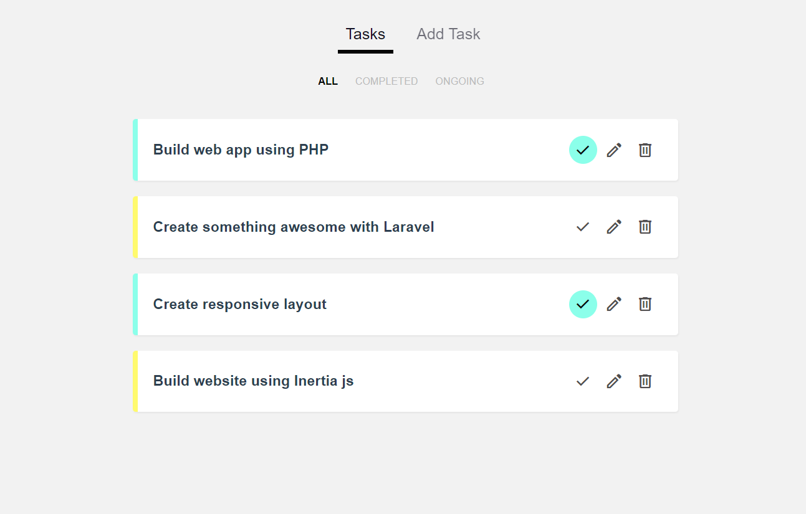

# Task Tracker App with Vue js (Options API)



## Project setup
```
npm install
```

## run json server
```
jsx json-server data/db.json
```
#### Or if you prefer using database [Firebase](https://firebase.google.com/) also is a great option


## Compiles and hot-reloads for development
```
npm run serve
```

## Compiles and minifies for production
```
npm run build
```


### Customize configuration
See [Configuration Reference](https://cli.vuejs.org/config/).
